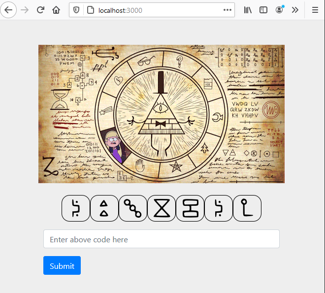
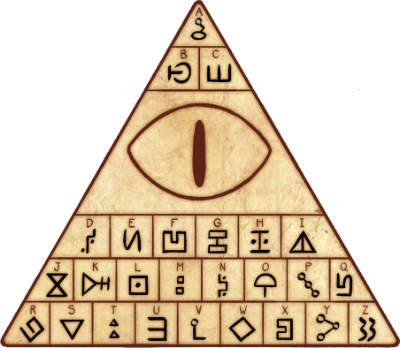
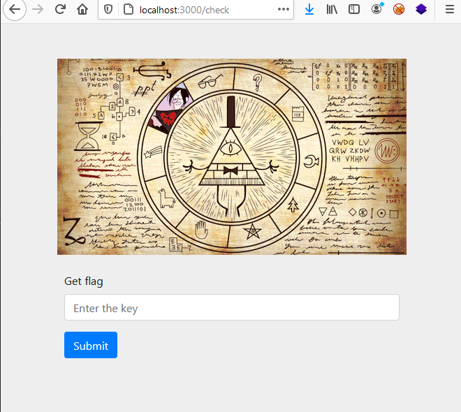
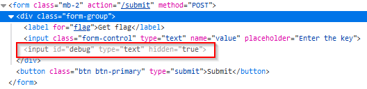
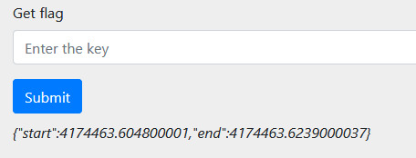
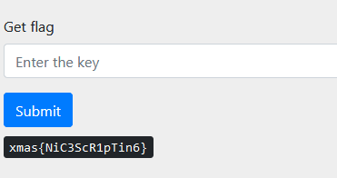

# Gravity Falls

Gravity Falls is a web/crypto CTF challenge.

## Description

Santa visited a Gravity Falls town. While visiting, he met a triangular man called Bill, who stole his gifts. To get them back, he must decode some strange hieroglyphics symbols. Help him do it and save Christmas!

The flag contains only printable characters.

## Solution

### Step 1

Landing page

The goal is to decode symbols. The symbols are used by [Bill Chiper](https://www.dcode.fr/gravity-falls-bill-cipher).

Bill Chiper symbol decoder.

### Step 2

The goal is to look at the source code of the page and find a hidden input field called "debug". Edit this field in such a way that the input value is also submitted in form. This get us from server some additional information about request processing duration, start and end time. With this we can solve challenge, look at **solution/solve.py** file.

Flag page

Hidden input field

Debug informations

Flag rendered

